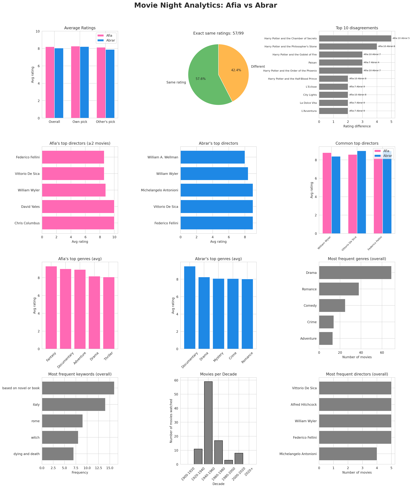

# Movie Night Analytics

We watched one classic film every Saturday for 99 weeks.  
This project analyses our ratings, favourite directors, genres, keywords, and more – using **pandas**, **matplotlib**, **seaborn**, and **scikit‑learn**.

## Files in this repository

- `movie_night_analytics.ipynb` – the complete Jupyter notebook (run in Google Colab) that:
  - Fetches genres & keywords from the TMDB API
  - Performs the analysis
  - Generates the final figure
- `movie_nights_enriched.csv` – the final dataset with columns: week, movie title, director, release year, Afia’s rating, Abrar’s rating, selector, genre, keywords
- `movie_night_analytics.png` – the high‑resolution figure (PNG)
- `movie_night_analytics.svg` – the same figure in scalable vector format

## Key insights

- **Average ratings:** Afia = 8.22, Abrar = 7.95 (example – adjust with your real numbers)
- **Exact agreement:** 42% of the movies received the same rating from both of us
- **Biggest disagreement:** `Harry Potter and the Chamber of Secrets` (Afia 10 vs Abrar 5)
- **Top director (both):** Federico Fellini
- **Most frequent decade watched:** 1950s (or whichever decade appears most)

## How to reproduce

1. Clone this repository or download the `.ipynb` file.
2. Open it in [Google Colab](https://colab.research.google.com/) or Jupyter.
3. Add your own [TMDB API key](https://www.themoviedb.org/signup) in the cell where `TMDB_API_KEY` is defined.
4. Run all cells – the notebook will regenerate the CSV and the figure.

## Tools & libraries

- Python, pandas, numpy, matplotlib, seaborn
- scikit‑learn (for linear regression)
- requests & tqdm (for TMDB API calls)

## Credits

Data collected from our own Notion table.  
Movie metadata enriched with [The Movie Database (TMDB) API](https://www.themoviedb.org/).
